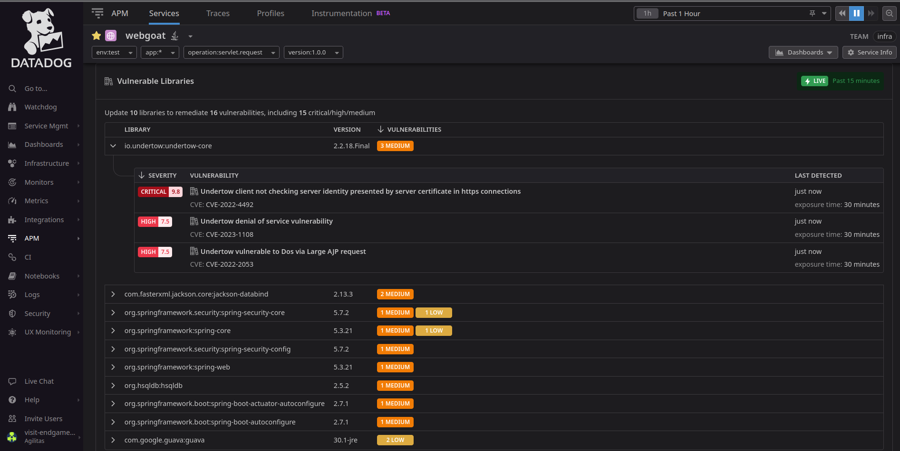

# WebGoat 8: A deliberately insecure Web Application

[](https://github.com/WebGoat/WebGoat/actions/workflows/build.yml)
[](https://jdk.java.net/)
[](https://owasp.org/projects/)
[](https://github.com/WebGoat/WebGoat/releases/latest)
[](https://gitter.im/OWASPWebGoat/community?utm_source=badge&utm_medium=badge&utm_campaign=pr-badge)
[](https://github.com/WebGoat/WebGoat/discussions)

# Modification

## Instructions for tracing the WebGoat application with DataDog Java tracer

The goal here, is to explore the **DataDog** APM solution, mainly for testing the profiling and security assessment capabilities.


Here is a sneak peek on how discovered vulnerabilities get displayed in the WebGoat service page in DataDog APM module.
Once we activate **Application Security** integration, the Service page gets enhanced with a security debt management section.

The current repository was forked from the upstream official repo.
The only introduced change that you will find here, if the formula relating how to inject the Datadog Tracer into the Docker Image, a subsequent step following the mandatory packaging of the WebGoat application).

You'll require to have a valid DataDog account, and a DataDog agent either deployed as a Docker container (*using the same Docker virtual network as the WebGoat container*), or deployed locally on the host machine (*alongside the docker daemon*)

You will find more explaining,  as comments, in the **Dockerfile** as well.

```shell
# Let's build the image, once we have generated as instructed below, the WebGoat application archive with Maven
docker build .  --no-cache --pull -t adilusprimus/webgoat-dd:vtest10

# You can now publish it (if required) to Docker Hub
docker push adilusprimus/webgoat-dd:vtest10

# Let's start the application with the DataDog Java tracer environment variables (I exposed it on port 9080)
docker run -e DD_ENV="test" \
           -e DD_SERVICE="webgoat" \
           -e DD_VERSION="1.0.0" \
           -l com.datadoghq.tags.env="test" \
           -l com.datadoghq.tags.service="webgoat" \
           -l com.datadoghq.tags.version="1.0.0" \
           -e DD_APM_ENABLED=true \
           -e DD_RUNTIME_METRICS_ENABLED=true \
           -e DD_DYNAMIC_INSTRUMENTATION_ENABLED=true \
           -e DD_AGENT_HOST="localhost" \
           -e DD_TRACE_AGENT_PORT="8126" \
           -e DD_LOGS_INJECTION=true \
           -e DD_LOGS_ENABLED=true \
           -e DD_PROCESS_AGENT_ENABLED=true \
           -e DD_APPSEC_ENABLED=true \
           -e DD_PROFILING_ENABLED=false -p 9080:8080 -t adilusprimus/webgoat-dd:vtest10

 [dd.trace 2023-09-25 07:48:59:336 +0000] [main] INFO io.sqreen.powerwaf.NativeLibLoader - Will load native library
[dd.trace 2023-09-25 07:48:59:460 +0000] [main] WARN com.datadog.appsec.powerwaf.PowerWAFModule - WAF has rule against unknown address graphql.server.all_resolvers
[dd.trace 2023-09-25 07:48:59:462 +0000] [main] INFO com.datadog.appsec.powerwaf.PowerWAFModule - Created new WAF context with rules (146 OK, 0 BAD), version 1.8.0
[dd.trace 2023-09-25 07:48:59:493 +0000] [main] INFO com.datadog.appsec.AppSecSystem - AppSec is FULLY_ENABLED with powerwaf(libddwaf: 1.12.0) loaded
[dd.trace 2023-09-25 07:48:59:496 +0000] [main] INFO com.datadog.debugger.agent.DebuggerAgent - Starting Dynamic Instrumentation
[dd.trace 2023-09-25 07:48:59:738 +0000] [dd-task-scheduler] INFO datadog.trace.agent.core.StatusLogger - DATADOG TRACER CONFIGURATION {"version":"1.21.0~7ab7c4f068","os_name":"Linux","os_version":"6.2.0-33-generic","architecture":"amd64","lang":"jvm","lang_version":"17.0.8.1","jvm_vendor":"Eclipse Adoptium","jvm_version":"17.0.8.1+1","java_class_version":"61.0","http_nonProxyHosts":"null","http_proxyHost":"null","enabled":true,"service":"webgoat","agent_url":"http://localhost:8126","agent_error":true,"debug":false,"trace_propagation_style_extract":["datadog"],"trace_propagation_style_inject":["datadog"],"analytics_enabled":false,"sampling_rules":[{},{}],"priority_sampling_enabled":true,"logs_correlation_enabled":true,"profiling_enabled":true,"remote_config_enabled":true,"debugger_enabled":true,"appsec_enabled":"FULLY_ENABLED","telemetry_enabled":true,"dd_version":"1.0.0","health_checks_enabled":true,"configuration_file":"no config file present","runtime_id":"5a29d282-e442-4bfb-b9e9-938cadb94edf","logging_settings":{"levelInBrackets":false,"dateTimeFormat":"'[dd.trace 'yyyy-MM-dd HH:mm:ss:SSS Z']'","logFile":"System.err","configurationFile":"simplelogger.properties","showShortLogName":false,"showDateTime":true,"showLogName":true,"showThreadName":true,"defaultLogLevel":"INFO","warnLevelString":"WARN","embedException":false},"cws_enabled":false,"cws_tls_refresh":5000,"datadog_profiler_enabled":true,"datadog_profiler_safe":true,"datadog_profiler_enabled_overridden":false}
          
```

*Start of the original README.md*

# Introduction

WebGoat is a deliberately insecure web application maintained by [OWASP](http://www.owasp.org/) designed to teach web
application security lessons.

This program is a demonstration of common server-side application flaws. The
exercises are intended to be used by people to learn about application security and
penetration testing techniques.

**WARNING 1:** *While running this program your machine will be extremely
vulnerable to attack. You should disconnect from the Internet while using
this program.*  WebGoat's default configuration binds to localhost to minimize
the exposure.

**WARNING 2:** *This program is for educational purposes only. If you attempt
these techniques without authorization, you are very likely to get caught. If
you are caught engaging in unauthorized hacking, most companies will fire you.
Claiming that you were doing security research will not work as that is the
first thing that all hackers claim.*

# Installation instructions:

For more details check [the Contribution guide](/CONTRIBUTING.md)

## 1. Run using Docker

Every release is also published on [DockerHub](https://hub.docker.com/r/webgoat/webgoat).

The easiest way to start WebGoat as a Docker container is to use the all-in-one docker container. This is a docker image that has WebGoat and WebWolf running inside.

```shell
docker run -it -p 127.0.0.1:8080:8080 -p 127.0.0.1:9090:9090 -e TZ=Europe/Amsterdam webgoat/webgoat
```

If you want to reuse the container, give it a name:

```shell
docker run --name webgoat -it -p 127.0.0.1:8080:8080 -p 127.0.0.1:9090:9090 -e TZ=Europe/Amsterdam webgoat/webgoat
```

As long as you don't remove the container you can use:

```shell
docker start webgoat
```

This way, you can start where you left off. If you remove the container, you need to use `docker run` again.

**Important**: *Choose the correct timezone, so that the docker container and your host are in the same timezone. As it is important for the validity of JWT tokens used in certain exercises.*

## 2. Standalone

Download the latest WebGoat release from [https://github.com/WebGoat/WebGoat/releases](https://github.com/WebGoat/WebGoat/releases)

```shell
java -Dfile.encoding=UTF-8 -Dwebgoat.port=8080 -Dwebwolf.port=9090 -jar webgoat-2023.3.jar
```

Click the link in the log to start WebGoat.

## 3. Run from the sources

### Prerequisites:

* Java 17
* Your favorite IDE
* Git, or Git support in your IDE

Open a command shell/window:

```Shell
git clone git@github.com:WebGoat/WebGoat.git
```

Now let's start by compiling the project.

```Shell
cd WebGoat
git checkout <<branch_name>>
# On Linux/Mac:
./mvnw clean install

# On Windows:
./mvnw.cmd clean install

# Using docker or podman, you can than build the container locally
docker build -f Dockerfile . -t webgoat/webgoat
```

Now we are ready to run the project. WebGoat 8.x is using Spring-Boot.

```Shell
# On Linux/Mac:
./mvnw spring-boot:run
# On Windows:
./mvnw.cmd spring-boot:run

```

... you should be running WebGoat on http://localhost:8080/WebGoat momentarily.

Note: The above link will redirect you to login page if you are not logged in. LogIn/Create account to proceed.

To change the IP address add the following variable to the `WebGoat/webgoat-container/src/main/resources/application.properties` file:

```
server.address=x.x.x.x
```

## 4. Run with custom menu

For specialist only. There is a way to set up WebGoat with a personalized menu. You can leave out some menu categories or individual lessons by setting certain environment variables.

For instance running as a jar on a Linux/macOS it will look like this:

```Shell
export EXCLUDE_CATEGORIES="CLIENT_SIDE,GENERAL,CHALLENGE"
export EXCLUDE_LESSONS="SqlInjectionAdvanced,SqlInjectionMitigations"
java -jar target/webgoat-2023.3-SNAPSHOT.jar
```

Or in a docker run it would (once this version is pushed into docker hub) look like this:

```Shell
docker run -d -p 8080:8080 -p 9090:9090 -e TZ=Europe/Amsterdam -e EXCLUDE_CATEGORIES="CLIENT_SIDE,GENERAL,CHALLENGE" -e EXCLUDE_LESSONS="SqlInjectionAdvanced,SqlInjectionMitigations" webgoat/webgoat
```

